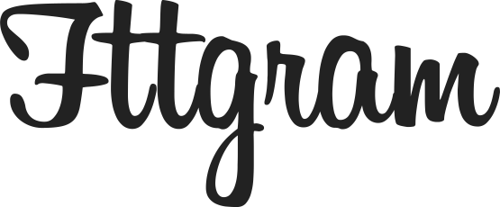

<h3 align="center">
    
</h3>

<h1 align="center"></h1>

<h3 align="center">
  Fttgram
</h3>

  

  

  

  

  

  <a href="#rocket-sobre">Sobre</a>&nbsp;&nbsp;&nbsp;|&nbsp;&nbsp;&nbsp;
  <a href="#wrench-stack-e-tools">Stack utilizada</a>&nbsp;&nbsp;&nbsp;|&nbsp;&nbsp;&nbsp;
  <a href="#arrow-forward-execuçao">Execução</a>&nbsp;&nbsp;&nbsp;|&nbsp;&nbsp;&nbsp;
  <a href="#memo-licença">Licença</a>

## :rocket: Sobre

Bem vindos ao **Fttgram**, UI clone do feed do Instagram!

Este projeto foi proposto pelo Prof. Mestre [Daniel Carvalho](https://github.com/danielscarvalho) na disciplina de Linguagem de Programação III da **FTT**.

O objetivo era construir um aplicativo em Cordova utilizando somente HTML, CSS e JavaScript, com o requisito de consumir 4 apis distintas com a **fetch API**.

Decidimos construir um feed semelhante ao do Instagram para consumir 4 apis diferentes de imagens, sendo elas:

- Unsplash
- Giphy
- Wallhaven
- TheCatAPI

### Tela da Aplicação

Em construção.

## :wrench: Stack e Tools

- [HTML](https://www.w3schools.com/html/)
- [CSS](https://www.w3schools.com/css/)
- [JavaScript](https://www.w3schools.com/js/)
- [Apache Cordova](https://cordova.apache.org/)
- [Unsplash API](https://unsplash.com/developers)
- [Giphy API](https://developers.giphy.com/)
- [Wallhaven API](https://wallhaven.cc/help/api)

## :arrow_forward: Execução

Em construção.

## :memo: Licença

Esse projeto está sob a licença MIT.

---

Made with ♥ by:
- [leandrovi](https://github.com/leandrovi) :wave:
- [ighorscavone](https://github.com/ighorscavone) :wave:
- [JFelipeAB](https://github.com/JFelipeAB) :wave:
- [M4theuSnk](https://github.com/M4theuSnk) :wave:
